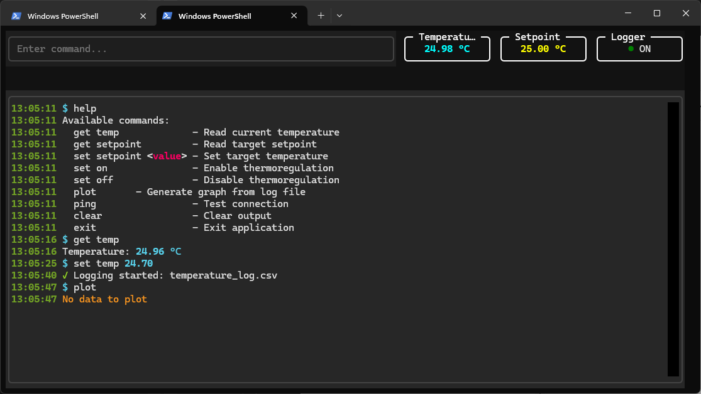
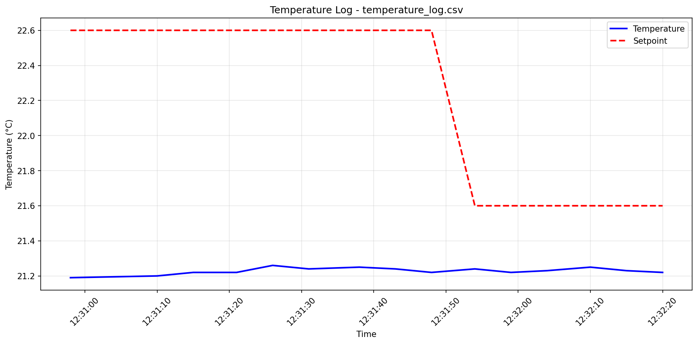

## HuberPkg — internal package for Huber thermostat control



### Installation

Install the package from the repository root:
```

pip install -e .\HuberPkg\

```

Install all required dependencies:
```

pip install -r .\requirements.txt

```

### Execution

Run the main console application:
```

python.exe main.py

```

### Plot generation



If logging was enabled, generate the latest temperature plot:
```

plot

```

To specify a file located in the same directory as `main.py`:
```

plot name.csv

```

